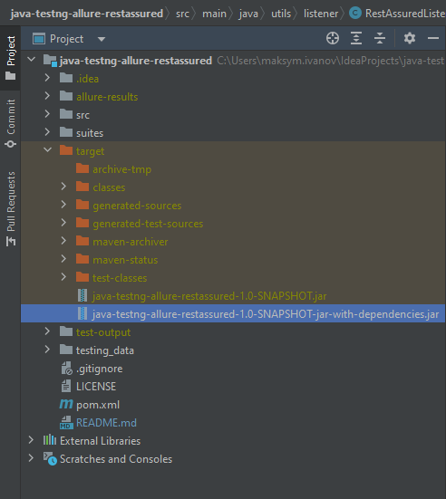
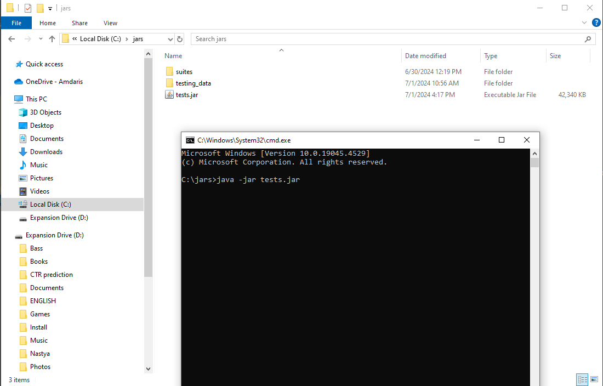
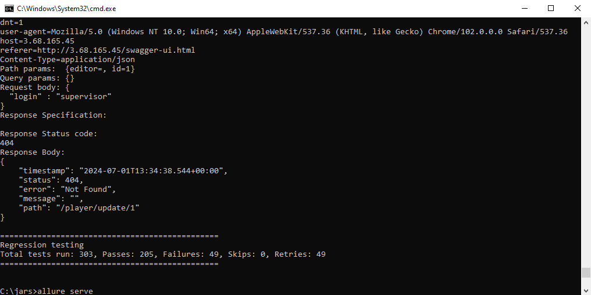
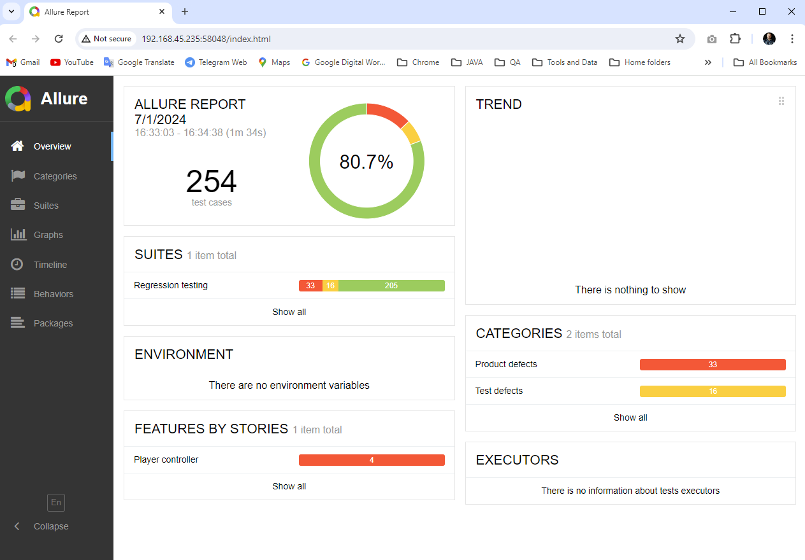

# java-testng-allure-restassured

Testing task:
> Stack: Java 11, testNG
> 
> Assignment:
> Write a framework for app testing
> 
> Write one positive and one negative autotest for each controller
> 
> Find possible bugs. Critical ones cover with autotests.
> 
>
>Additional:
> 
>*. Add Allure
> 
>** Make test run in 3 treads
> 
>*** Add logging
> 
>**** Add framework configuration (app url, thread count, etc.)

## Project Features

### Data driven testing
The project implemented based on Data Driven principle extracting testing data from testing logic.
The data can be updated and stored separately from testing project and can be used in remote servers or docker images.
The testing data stored in xlsx-files, so can be updated by non-tech specialists or manual QAs.

### Configuration of the project slitted to 3 files (3 contexts for further CI/CD):
* **Environment** properties related to base url and other environment data
* **Test** properties related to testing data
* **TestNG** properties related to TesNG configuration

### TestNG configuration
TestNG configuration contains following parameters:
* suite - suite name for execution
* thread.count - count of threads for parallel execution
* data.provider.thread.count - count of threads for parallel execution of data providers
* max.retry - number of retries for failed tests

### Listeners 
* AllureRestAssured - used for getting detailed info about requests and responses in Allure-report
* RestAssuredListener - used for getting detailed info about requests and responses in logs 
* RetryListener - used for implementing retry feature.

### Parallelism
Can be provided by 3 items
1. ThreadCount parameter
2. DataProviderThreadCount parameter
3. And by configuring of 2-level suites (see regression.xml testng xml-file), min execution time ~12-14 seconds, by 10 threads. 

### Executable JAR file
I use jar with dependencies for copying it in remote PC / docker container and execute it in pipelines of any CI/CD tool.
you can create an executable JAR by following maven command:

`mvn clean package` or \
`mvn clean package -DskipTests` (if you need to skip tests)

You will get 2 jar-files int 'target' folder,  
copy the jar-with-dependencies to a destination place, where you want to execute the tests.

You can rename the jar-file to smaller name it will be convenient to execute it. 
>Important! \
Copy 'suites' and 'testing_data' folders to the same destination place.

Run following command to execute tests from jar-file: \
`java -jar <jar-filename>.jar`

when you get tests executed run following command to run allure server to see testing report: \
`allure serve`

You will get the Allure report web-page opened:

